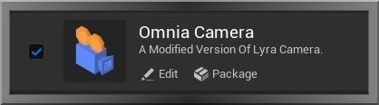
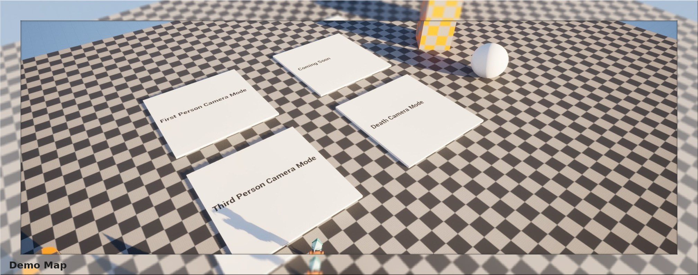
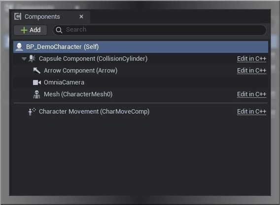
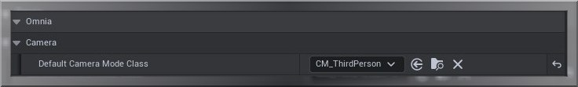
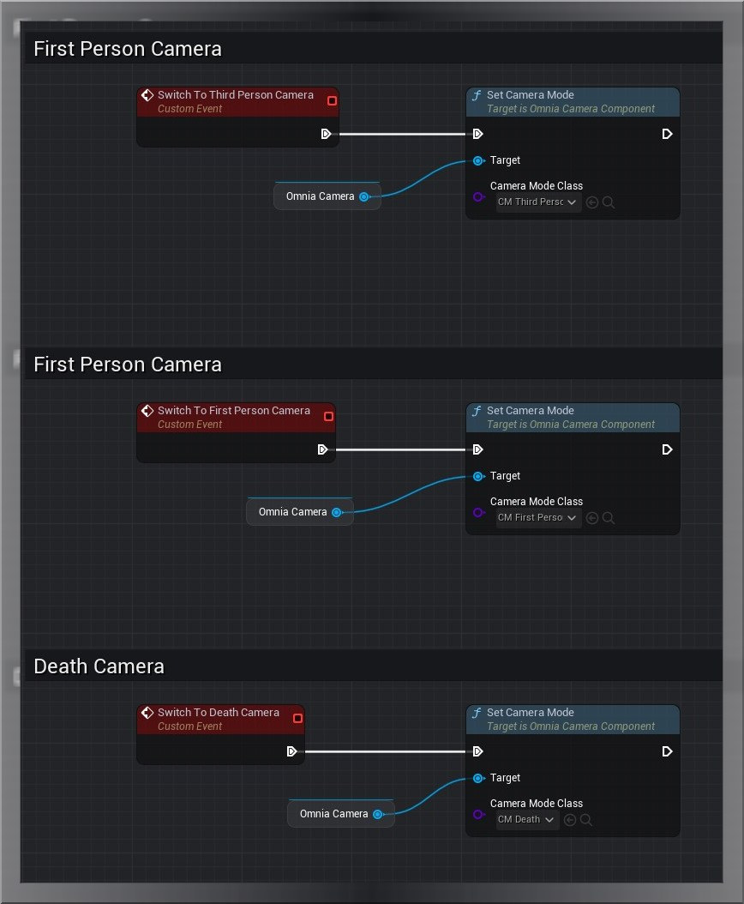
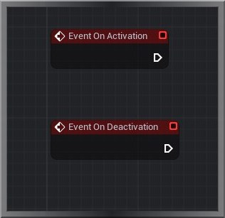
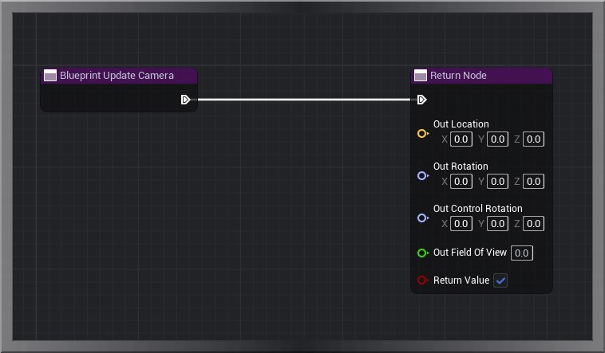
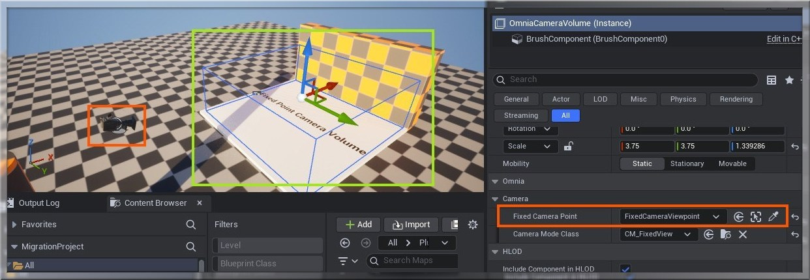

  

# 🎥 Omnia Camera System

An Extended and Modular Plugin based version of Lyra Camera for Unreal Engine 5, Blueprint Friendly And Can be used without GAS.  

## 💾 Install

To Install simply place the OmniaCamera Folder in your **"ProjectDirectory/Pluigns"** folder.  
Check if the Plugin is Enabled In your Project Plugin window:  

  

  

## 🧩 Features

- Configurable Blending between Camera Modes.  
- Blueprint Spawnable Component.  
- Modular and Decoupled from GAS and Lyra related Classes.  
- Utility Functions to Clear and Swap out Camera Modes.  
- You can extend the **"OmniaCameraMode"** Class to make your Own Camera Modes Just by Following Any Lyra Camera Tutorial.  
- Camera Volume with Viewpoint Reference.  

## 🎞️ Camera Modes

Currently This Plugin comes with the following Camera Modes:  
- First Person  
- Third Person  
- Death Camera  
- Fixed View Point  

There are two Vector Curves that control the Positions of Camera Veiw in Third Person and Death Camera.  

## 🗺️ Demo Map

Inside this plugin there is a demo map in which you can try out different cameras and features of this plugin.  
- `Omnia Camera Content -> Maps -> DemoMap`  

  

  

## 🚀 Getting Started

- First Add the Omnia Camera Component to your Character or Pawn **(No Need to Add Spring Arm)**.  

  

  

- You can also set the default Camera Mode inside the Omnia Camera Component:  

  

  

- To Change the Camera Mode Simply Call this function using the Omnia Camera Component Reference:  

  

  

- To add custom functionality to your camera modes when the camera mode is activated and deactivated use these events:

  

  

- You can also override the final camera view using `Blueprint Update Camera` function override, Make sure return true. This works just like Unreal's Standard Player Camera Manager.

  

  

- To Use Camera Volumes, you can place down `AOmniaCameraVolume` using the place actors tab.

  

  

- If your Camera Mode inherits from `UOmniaCameraMode_Static` or `UOmniaCameraMode_Fixed` You can add a reference to any view point actor and use that as a pivot point for your camera view.

  

  